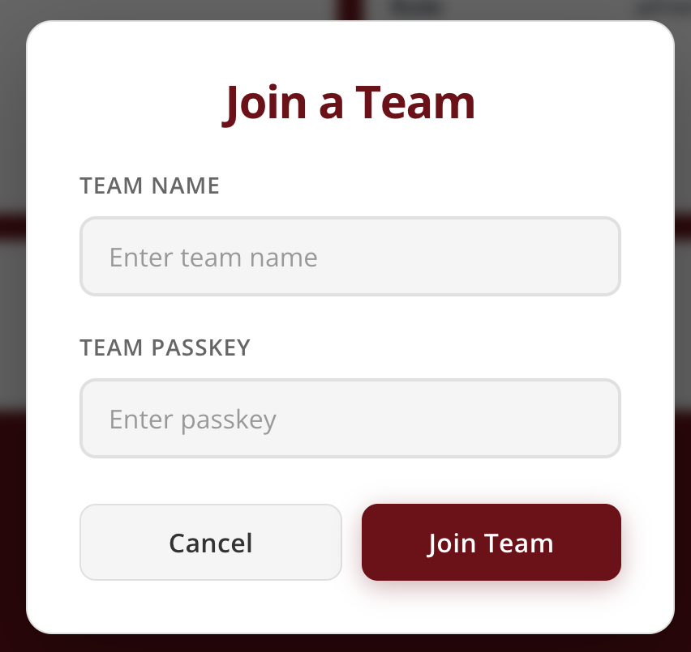
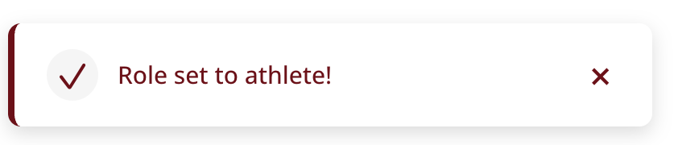
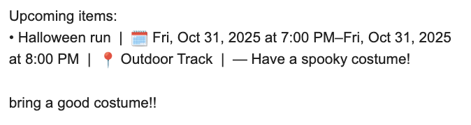
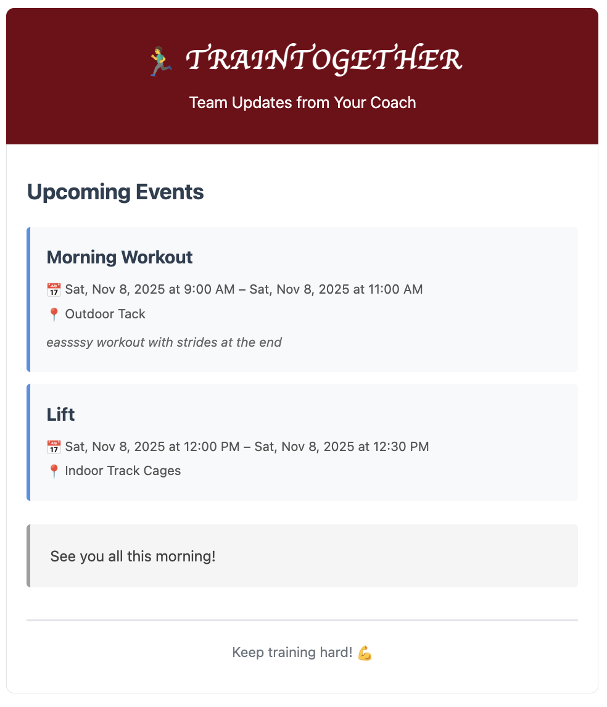

# Final Project Design Document

[Concepts](#concepts)

See all of the concepts and changes made from Assignment 4b

- [CalanderEvent](#calanderevent)
- [UserDirectory](#userdirectory)
- [TeamMembership](#teammembership)
- [Notification](#notification)
- [TrainingRecords](#trainingrecords)

[Syncs](#syncs)

See all of the syncs organized with descriptions and purposes

[Design Updates](#design-updates)

Visual design changes made from assignment 4b submission

## Concepts

### CalanderEvent

[Link to Concept](../../Train-Together/src/concepts/CalanderEvent/CalanderEventConcept.md)

**Changes from 2:**
Redesigned the concept for easier event management and frontend integration. Added a stable id field for reliable lookups, plus a getEventsByDate(day, month, year) action to support daily calendar views. Removed role-based logic so events can be created and modified without user coupling, keeping authorization in syncs. Optional fields like description and link make the model more flexible for different event types.

**Changes from 4b:**
Removed the duplicateEvent action since it did not feel really needed and you can just create an event regularly

### UserDirectory

[Link to Concept](../../Train-Together/src/concepts/UserDirectory/UserDirectoryConcept.md)

**Changes from 2:**
Adopted Google sign-in as the primary authentication method, leading to changes in state and actions to support login via Google ID tokens, record authentication metadata, and separate identity updates. Added google, primaryAuth, and lastLoginAt fields, with userId now serving as the canonical identifier. Introduced loginWithGoogleIdToken(idToken) to handle authentication and user creation, replacing the old register flow. Identity actions (setName, setRole, setGender) now operate independently, and query helpers (getUser, getUserRole, getAthletesByGender, planned getWeeklyMileage) improve role verification and coach workflows.

**Changes from 4b:**
Deleted getAthletesByGender because it does not serve a use in this current implementation--I think on further implementations of this app I would add this back so the coach can see certain trends amongst women and men

### TeamMembership

[Link to Concept](../../Train-Together/src/concepts/TeamMembership/TeamMembershipConcept.md)

**Changes from 2:**
Redesigned to simplify team management and align with coach/athlete UI flows while moving role logic outside the concept. Added stable team IDs, new lookup helpers, and removed embedded role checks for better modularity. The concept now defines id, coach, and athletes fields, with role constraints documented but enforced elsewhere. Updated actions (createTeam, addAthlete, removeAthlete) drop role requirements, and new helpers (getTeamByCoach, getTeamByAthlete, getAthletesByTeam) support cleaner frontend queries.

**Changes:**
Added the deleteTeam action so that the coach can dispand a team to create a new one

### Notification

[Link to Concept](../../Train-Together/src/concepts/Notification/NotificationConcept.md)

**Changes form 2:**
Simplified the concept to focus on one clear use case: a coach creating and sending an email digest of events to selected recipients. Removed complex scheduling and multi-channel logic, keeping only essential actions (create, addEvent, send) for clarity and testability. Added a sender field for verification, defined Events as a set of event summaries, and removed repetition/status fields. This refactor preserves the intended UX while making the system lighter, modular, and easier to extend later.

**Changes from 4b:**
Removed the addEvent action because when you create a notification is sends automatically so you don't need to addEvents after the fact

### TrainingRecords

[Link to Concept](../../Train-Together/src/concepts/Notification/NotificationConcept.md)

**Changes from 2:**
Refocused the concept solely on athlete monitoring and week-over-week summaries, removing coach-planning CRUD, AI summaries, and Google Sheets integration to simplify scope and improve testability. Daily athlete data (AthleteData) is now canonical in-app, and summaries (WeeklySummary) compute averages and trends using structured Comparison objects. Actions include logData for daily entries and createWeeklySummary for generating weekly metrics. Role checks are handled externally, keeping the concept clean, deterministic, and centered on accurate, auditable training data.

**Changes from 4b:**
Added listEntries so that the front end can display all of the entries for a user

## Syncs

- [Coach roles](./SyncDesign.md#coach-roles) — Coach-scoped operations (team lifecycle and event management) require authorization checks and ownership verification. Placing these checks in synchronizations keeps the concept implementations simple and reusable across different interfaces, while allowing syncs to orchestrate multi-step flows and enrich frames with necessary user data.
- [Athlete roles](./SyncDesign.md#athlete-roles) — Athlete-specific actions (joining/leaving teams, logging mileage) should validate the actor's role and normalize inputs before calling concept actions. The syncs perform these validations and fetch full user objects so the concept layer receives consistent, well-formed data and doesn't need to encode permission logic.
- [Prevent role change while on a team](./SyncDesign.md#prevent-role-change-while-on-a-team) — Changing a user's role can break team invariants (for example, removing a coach from an active team). The sync guards this operation by checking current team membership first and returning a clear error when a role change would leave a team in an invalid state.
- [Notification: create -> send](./SyncDesign.md#notification-create---send) — Notifications require gathering related data (sender, recipients, event summaries) and then sending the assembled message. The syncs orchestrate data lookup and creation, then trigger an immediate send so the UX is simple (create-and-send) while keeping notification composition logic out of the concept's core responsibilities.

## Design Updates

Primarily with updating my design, although I liked the functionality of things, I felt that I wanted more aesthetic notifications. So I rather than drop down error messages or forms, I created individual widgets.

	
	

Next I also wanted to update the email to make the events more clear and aesthetically pleasing. On the left is the original and the right is the new design.

	
	

